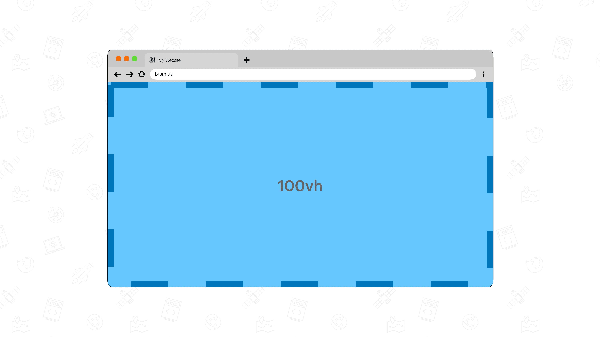
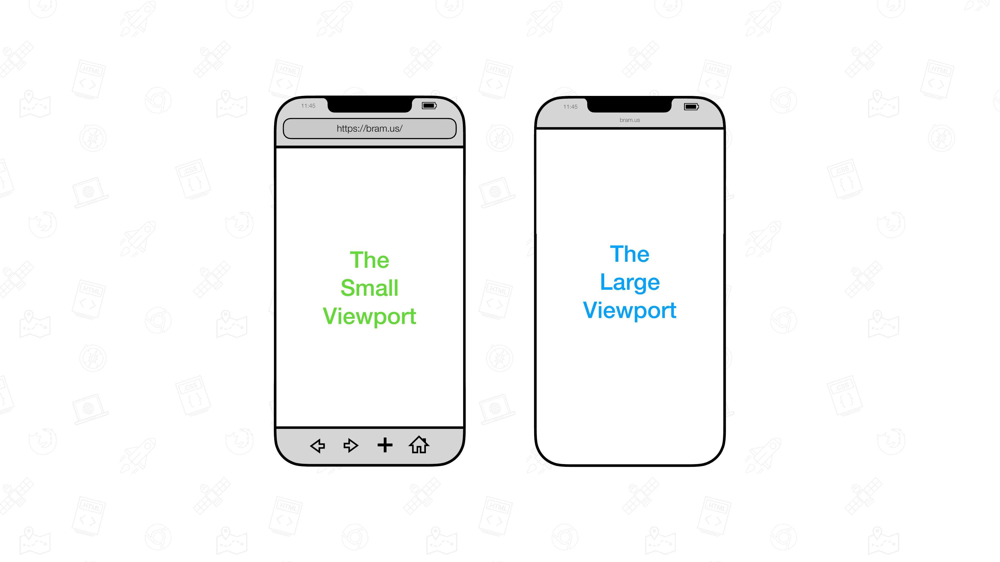
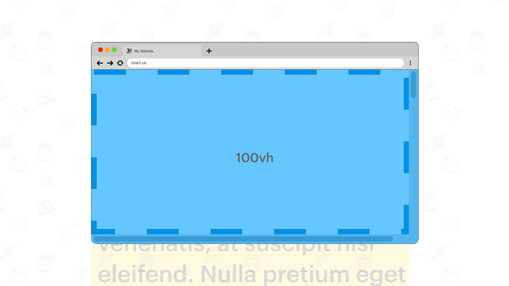
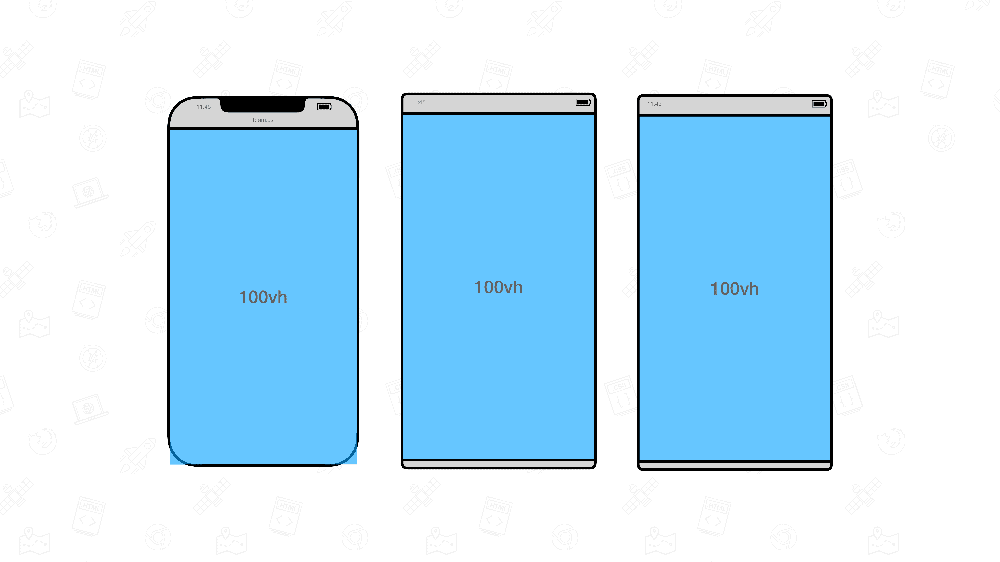

# Viewport-percentage Lengths _(aka “Viewport-relative Units”)_

## Definition

Unlike their name suggest, Viewport Units are **not** based on the size of [the Viewport](./layout-viewport.md) but are based on the size of the [ICB](./icb.md). As per [CSS Values and Units Module Level 4 specification](https://drafts.csswg.org/css-values-4/#viewport-relative-lengths):

> The viewport-percentage lengths are relative to the size of the initial containing block

But since [the ICB takes its size from the Layout Viewport](./icb.md#definition) _(for continuous media)_, there is a connection to the Layout Viewport:

Layout Viewport → Initial Containing Block → Viewport-percentage lengths

Generally speaking, a Viewport-percentage Length is Equal to 1% of the targeted axis. Its actual pixel value change as the ICB size changes

> When the height or width of the initial containing block is changed, they are scaled accordingly.

Taking [the UA-Default Viewport](#ua-default-viewport) as an example, its linked units are:

- `vw` = 1% of the width of the viewport size
- `vh` = 1% of the height of the viewport size
- `vi` = 1% of the size of the viewport’s inline axis
- `vb` = 1% of the size of the viewport’s block axis
- `vmin` = the smaller of `vw` or `vh`
- `vmax` = the larger of `vw` or `vh`

## Visualization

To visualize the viewport units, we can set an element’s width/height to those units

```css
#el {
    position: absolute;
    top: 0;
    left: 0;
    width: 100vw;
    height: 100vh;

    background: var(--lightblue);
}
```

On desktop _(with no scrollbars present)_, it looks like this:



On mobile, it looks like this:


To authors this seems weird, but [its behavior is explained below](#size-of-the-ua-default-viewport-on-mobile).

## Types of Viewport-percentage Lengths

Since [the Layout Viewport can change size](./layout-viewport.md#size) as UA UI elements contract or expand, there are different types specific Layout Viewport Sizes that [can be defined](https://drafts.csswg.org/css-values-4/#viewport-relative-lengths).



Each type of specific Layout Viewport has Viewport-percentage Lengths assigned with it.
### The Large Viewport

The Large Viewport is the viewport sized assuming any UA UI Elements that are dynamically expanded and retracted to be *retracted*. It has the `l`-prefix, so its linked units are `lvh` / `lvw` / `lvb` / `lvi` / `lvmin` / `lvmax`.

> The large viewport-percentage units (`lv*`) are defined with respect to the large viewport size: the viewport sized assuming any UA interfaces that are dynamically expanded and retracted to be retracted. This allows authors to size content such that it is guaranteed to fill the viewport, noting that such content might be hidden behind such interfaces when they are expanded.
> 
> The sizes of the large viewport-percentage units are fixed (and therefore stable) unless the viewport itself is resized.


### The Small Viewport

The Small Viewport is the viewport sized assuming any UA UI Elements that are dynamically expanded and retracted to be *expanded*. It has the `s`-prefix, so its linked units are `svh` / `svw` / `svb` / `svi` / `svmin` / `svmax`.

> The small viewport-percentage units (`sv*`) are defined with respect to the small viewport size: the viewport sized assuming any UA interfaces that are dynamically expanded and retracted to be expanded. This allows authors to size content such that it can fit within the viewport even when such interfaces are present, noting that such content might not fill the viewport when such interfaces are retracted.
> 
> The sizes of the small viewport-percentage units are fixed (and therefore stable) unless the viewport itself is resized.


### The Dynamic Viewport

The Dynamic Viewport is the viewport sized with dynamic consideration of any UA UI Elements. It will automatically adjust itself in response to UA interface elements being shown or not. It has the `d`-prefix.

> The dynamic viewport-percentage units (`dv*`) are defined with respect to the dynamic viewport size: the viewport sized with dynamic consideration of any UA interfaces that are dynamically expanded and retracted. This allows authors to size content such that it can exactly fit within the viewport whether or not such interfaces are present.
> 
> The sizes of the dynamic viewport-percentage units are not stable even while the viewport itself is unchanged. Using these units can cause content to resize e.g. while the user scrolls the page. Depending on usage, this can be disturbing to the user and/or costly in terms of performance.
> 
> The UA is not required to animate the dynamic viewport-percentage units while expanding and retracting any relevant interfaces, and may instead calculate the units as if the relevant interface was fully expanded or retracted during the UI animation. (It is recommended that UAs assume the fully-retracted size for this duration.)


### UA-default Viewport

The UA-default Viewport, which for any given document should be equivalent to the large viewport size, small viewport size, or some intermediary size. It has no prefix, so its linked units are `vh` / `vw` / `vb` / `vi` / `vmin` / `vmax`.

> The UA-default viewport-percentage units (`v*`) are defined with respect to a UA-defined UA-default viewport size, which for any given document should be equivalent to the large viewport size, small viewport size, or some intermediary size.

## Findings

💡 These findings are a textual representation of the [test results table](https://goo.gle/interop-2022-viewport-testresults).

### Effect of scrollbars

The presence of does not influence the size of the Viewport Units. This per spec:

> In all cases, scrollbars are assumed not to exist

When using [Overlay Scrollbars](./scrolling.md#overlay-scrollbars) this is no issue


However, when using [Classic Scrollbars](./scrolling.md#classic-scrollbars) this becomes an important note to make, as `100vh` and `100vw` grow “too large”. As a result, the UA also needs to add a horizontal scrollbar.



### Size of non-UA-default Viewport on Desktop

As all desktop browsers currently do not have dynamic UA UI elements, they – when the units are supported – size the Small and Large Viewport to the size of the UA-default Viewport.

### Size of the Small Viewport

For all mobile browsers, the Small Viewport size follows the size of the ICB.


### Size of the Large Viewport

For all mobile browsers, the Large Viewport size follows the size of the ICB + size of the dynamic UA UI Elements that have retracted.


### Size of the UA-default Viewport on Mobile

All mobile browsers seem to agree on sizing the UA-default Viewport to the Large Viewport. This explains that why, when giving an element a height of `100vh`, it gets partially obscured by the dynamic UA UI elements:




### Size of the Dynamic Viewport

The size of the Dynamic Viewport adapts itself when the UA UI Elements change.

The value of the `dv*` units are not updated immediately:

- When slowly scrolling, some browsers only do this after scrolling for a certain distance, while others respond immediately. The value isn’t updated at 60fps, but is throttled, for performance reasons we can assume
- When swiping over the screen and having the document scroll for a large distance, some browsers do not update the value for `dvh` until the scrolling has stopped

Some browsers allow the Dynamic Viewport grow larger than the Large Viewport. This is the case when users over pinch-zoom out in all browsers on iOS.

### Effect of Overscrolling / Bouncy Scroll

These units follow the size of the [Layout Viewport](./layout-viewport.md). Since the Layout Viewport’s size is not affected by Overscrolling, these units aren’t either.

## Issues

We are tracking issues using [the label `Viewport Units`](https://github.com/web-platform-tests/interop-2022-viewport/issues?q=is%3Aissue+label%3A%22Viewport+Units%22)