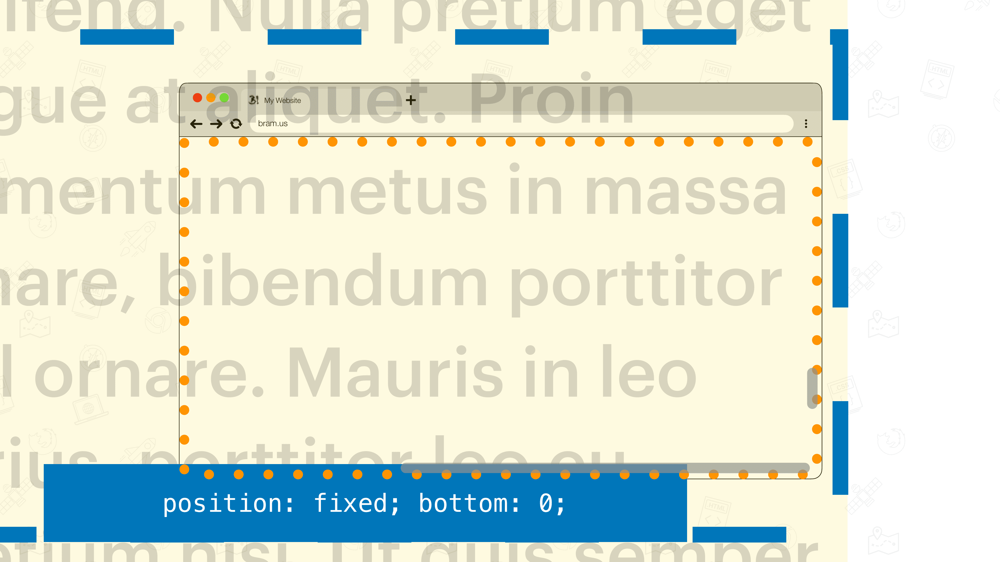

# The Visual Viewport

## Definition

From [the CSSOM Specification](https://drafts.csswg.org/cssom-view/#visual-viewport)

> The visual viewport is a kind of viewport whose scrolling area is another viewport, called the layout viewport.
> 
> In addition to scrolling, the visual viewport may also apply a scale transform to its layout viewport. This transform is applied to the canvas of the layout viewport and does not affect its internal coordinate space.

From [MDN](https://developer.mozilla.org/en-US/docs/Glossary/Visual_Viewport):

> The portion of the viewport that is currently visible is called the visual viewport
>
> The Visual Viewport can be smaller than the layout viewport, such as when the user has pinched-zoomed

## Visualization

To visualize it, authors can get sizing and positioning info of the Visual Viewport through the [Visual Viewport API](https://drafts.csswg.org/cssom-view/#the-visualviewport-interface)

```js
let {
    width,
    height,
    scale,
    offsetTop,
    offsetLeft,
    pageLeft,
    pageTop,
} = window.visualViewport;
```

These values are:

- `width` / `height` = Width and Height of the Visual Viewport
- `offsetTop` / `offsetLeft` = Distance from edges of the Visual Viewport to edges of the [Layout Viewport](./layout-viewport.md)
- `pageTop` / `pageLeft` = Distance from edges of the Visual Viewport to edges of the [ICB](./icb.md)
- `scale` = The scale factor _(default: `1`)_

Using a tab more JS, these values can be synced to Custom Properties which you can use to position an element that outlines this Visual Viewport

```js
document.documentElement.style.setProperty('--vvw', `${vvv.width}px`);
document.documentElement.style.setProperty('--vvh', `${vvv.height}px`);
document.documentElement.style.setProperty('--vvpt', `${vvv.pageTop}px`);
document.documentElement.style.setProperty('--vvpl', `${vvv.pageLeft}px`);
document.documentElement.style.setProperty('--vvot', `${vvv.offsetTop}px`);
document.documentElement.style.setProperty('--vvol', `${vvv.offsetLeft}px`);
document.documentElement.style.setProperty('--vvz', vvv.scale);
```

Depending on wether you are using `position: absolute` or `position: fixed`, you need to use these values differently:

```css
#visualviewport {
    box-sizing: border-box;
	border: 8px solid;
	border-image: repeating-linear-gradient(45deg, orange, orange 10px, transparent 10px, transparent 20px) 10;
}

#visualviewport {
	position: absolute;
	top: var(--vvpt, 0px);
	left: var(--vvpl, 0px);
	width: var(--vvw, 100%);
	height: var(--vvh, 100vh);
}
```

```css
#visualviewport {
    box-sizing: border-box;
	border: 8px solid;
	border-image: repeating-linear-gradient(45deg, orange, orange 10px, transparent 10px, transparent 20px) 10;
}

#visualviewport {
	position: fixed;
	top: var(--vvot, 0px);
	left: var(--vvol, 0px);
	width: var(--vvw, 100%);
	height: var(--vvh, 100vh);
	right: var(--vvol, 0px) + var(--vvw, 0px);
	bottom: var(--vvol, 0px) + var(--vvh, 0px);
}
```

👉 Try it out: [Visual Viewport](https://interop-2022-viewport.netlify.app/individual/visual-viewport/)

## Findings

💡 These findings are a textual representation of the [test results table](https://goo.gle/interop-2022-viewport-testresults).

## Size

As mentioned above, the Visual Viewport API can be used for this. Note that the size of Visual Viewport will be equal to or less than the [Layout Viewport](./layout-viewport.md)


### Effect of scrolling

The Visual Viewport updates nicely as you scroll and shifts down with the scroll position.


When UA UI Elements expand/contract is also updates accordingly, except in Edge on Android where there’s a few pixels missing. This bug is corrected as soon as you stop the gesture _(i.e. lift up your finger)_, then the correct values are flushed.


### Effect of scrollbars

The presence of [Classic Scrollbars](./scrolling.md#classic-scrollbars) take away space from the Visual Viewport

### Effect of pinch-zoom

The Visual Viewport updates nicely as you pinch zoom



In Safari on Desktop the values do not update immediately as you pinch-zoom, but are only updated when the gesture is finished  _(i.e. lifting up your fingers)_.

When you over pinch-zooming out in browsers that allow this _(i.e. all based on WebKit)_ something funky happens with the position and dimensions of the Visual Viewport:

- Its position gets anchored to `0,0` of the canvas. This origin moves between the top-left edge of the [Large and Small Viewport](./viewport-units.md#the-large-viewport) as you move around.
- The `width`/`height` is measured from that `0,0` origin _(which can move)_ to the right/bottom edge of the [Layout Viewport](./layout-viewport.md)

👀 See [Screenshot 1 of Safari on iOS](./screenshots/visual-viewport-mobile-safari-over-pinch-zoom-out-1.jpeg) and [Screenshot 2 of Safari on iOS](./screenshots/visual-viewport-mobile-safari-over-pinch-zoom-out-2.jpeg)

👀 See [Recording of Safari on iOS](./videos/visual-viewport-mobile-over-pinch-zoom-out--safari.mp4)

### Effect of the Virtual Keyboard

See [Virtual Keyboard: Findings](./virtual-keyboard.md#findings).

### Effect of Overscrolling / Bouncy Scroll

When [overscrolling](./scrolling.md#overscrolling-and-rubber-banding), WebKit allows negative values for `window.scrollX` and `window.scrollY`. This is the only engine to expose this. While doing so, the values for the Visual Viewport’s `pageTop` and `pageLeft` also become negative, while its `height` and `width` remain the same size. Because of this, the visualization of the Visual Viewport can get clipped by the [ICB](./icb.md) which [does bounce with the rubber banding effect](./icb.md#effect-of-overscrolling--bouncy-scroll)

👀 See [Recording of Safari on Desktop](./videos/visual-viewport-desktop-overscroll--safari.mp4) and [Recording of Safari on iOS](./videos/visual-viewport-mobile-overscroll--safari.mp4)

Other engines that do not allow negative values for `window.scrollX` and `window.scrollY` as it has a rubber banding effect going on – i.e. Chrome on macOS and Firefox on macOS – follow the same behavior as the [ICB](./icb.md): the bounce with the effect. The values for the `height` and `width` remain the same as it rubber bands.

👀 See [Recording of Firefox on Desktop](./videos/visual-viewport-desktop-overscroll--firefox.mp4) and [Recording of Chrome on Desktop](./videos/visual-viewport-desktop-overscroll--chrome.mp4)

In engines that keep the [Layout Viewport](./layout-viewport.md) in place as the browser rubber bands the values for `offsetTop` and `offsetLeft` remain `0`.

👀 See [Recording of Firefox on Desktop](./videos/visual-viewport-desktop-overscroll--firefox.mp4) and [Recording of Chrome with flag on Desktop](./videos/visual-viewport-desktop-overscroll--chrome-with-flag.mp4)

## Issues

We are tracking issues using [the label `Visual Viewport`](https://github.com/web-platform-tests/interop-2022-viewport/issues?q=is%3Aissue+label%3A%22Visual+Viewport%22)